# Telecom Subscription Funnel Intelligence

> "어디서 고객이 빠지고, 어떤 채널이 효과적이고, 어디에 집중해야 하는가?"
>
> Snowflake Marketplace 텔레콤 데이터 기반 퍼널 병목 진단 + 채널 최적화 + 지역 수요 예측 시스템

---

## Problem Statement

한국 텔레콤 기업의 가입 퍼널은 5단계를 거친다:
**상담요청 → 가입신청 → 등록완료 → 개통완료 → 결제완료**

각 단계에서 다음 단계로 넘어가는 비율을 **CVR(Conversion Rate, 전환율)**이라 한다.
각 단계에서 고객이 이탈하고, 38개 유입 채널의 효율이 다르며, 200개 시군구의 수요도 다르다.
이 세 가지 차원을 **데이터로 진단하고, 수학적 모델로 정량화하고, AI Agent로 전략을 제시**한다.

---

## 개발 워크플로우

```
[로컬 PC에서 개발]                    [Snowflake에서 실행]
───────────────                     ──────────────────
Streamlit 대시보드 개발/테스트         SQL 파이프라인 (워크시트)
Python ML 학습 (Snowpark 연결)        Cortex AI 함수 (서버 내부)
마르코프 체인, Monte Carlo 계산        Dynamic Tables, Tasks, Alerts
                    │
                    ▼
            deploy_sis.py 실행
                    │
                    ▼
         [Streamlit in Snowflake 배포]
         Snowsight에서 바로 접속 가능
```

---

## 아키텍처 다이어그램

```mermaid
graph TD
    subgraph Source["📦 Snowflake Marketplace"]
        V01["V01 Regional Contract"]
        V03["V03 Contract Funnel"]
        V04["V04 Channel Performance"]
        V05["V05 Regional Install"]
        V07["V07 GA4 Attribution"]
    end

    subgraph Staging["1단계: Staging (01_staging.sql)"]
        STG_F["STG_FUNNEL"]
        STG_C["STG_CHANNEL"]
        STG_R["STG_REGIONAL"]
        STG_M["STG_MARKETING"]
    end

    subgraph Analytics["2단계: Analytics (02_analytics.sql)"]
        FSD["FUNNEL_STAGE_DROP"]
        CE["CHANNEL_EFFICIENCY"]
        RDS["REGIONAL_DEMAND_SCORE"]
    end

    subgraph Mart["3단계: Mart (03_mart.sql)"]
        KPI["DT_KPI"]
        VFT["V_FUNNEL_TIMESERIES"]
        VCP["V_CHANNEL_PERFORMANCE"]
        VRH["V_REGIONAL_HEATMAP"]
    end

    subgraph ML["ML 파이프라인"]
        FS["ML_FEATURE_STORE<br/>(06_feature_store.sql)"]
        XGB["XGBoost 3-class<br/>(conversion_model.py)"]
        MR["Model Registry"]
    end

    subgraph CortexML["Cortex ML (04_cortex_ml.sql)"]
        FORE["FORECAST_OUTPUT<br/>시도별 3개월 예측"]
        ANOM["ANOMALY_OUTPUT<br/>계약수 급변 탐지"]
    end

    subgraph CortexAI["Cortex AI (11_cortex_ai_functions.sql)"]
        CAI["CHANNEL_AI_INSIGHT<br/>SENTIMENT + CLASSIFY + SUMMARIZE"]
        RAI["REGIONAL_AI_INSIGHT<br/>SENTIMENT + TRANSLATE"]
    end

    subgraph Governance["거버넌스"]
        DQ["DATA_QUALITY_RESULTS<br/>(07_data_quality.sql)<br/>매일 06:00 KST Task"]
        LIN["V_TABLE_LINEAGE<br/>(08_lineage.sql)"]
    end

    subgraph Agent["AI Agent (agents/orchestrator.py)"]
        ORC["Analyst → Strategist → Synthesizer<br/>Cortex COMPLETE"]
    end

    subgraph Dashboard["Streamlit 대시보드 (4 pages)"]
        P0["app.py<br/>KPI + 품질 + 리니지"]
        P1["1_진단.py<br/>Sankey + 버블 + 마르코프"]
        P2["2_기회_분석.py<br/>수요 + FORECAST + Monte Carlo"]
        P3["3_AI_전략.py<br/>Multi-Agent + Q&A"]
    end

    %% 메인 데이터 흐름
    V01 & V03 & V04 & V05 & V07 --> STG_F & STG_C & STG_R & STG_M
    STG_F & STG_C & STG_R --> FSD & CE & RDS
    FSD & CE & RDS --> KPI & VFT & VCP & VRH
    KPI & VFT & VCP & VRH --> Dashboard

    %% Cortex ML
    STG_R --> FORE & ANOM
    FORE & ANOM --> P2

    %% Feature Store → XGBoost
    STG_C --> FS
    FS --> XGB
    XGB --> MR
    MR --> P1

    %% Cortex AI
    CE --> CAI
    RDS --> RAI
    CAI & RAI --> P1 & P2

    %% Governance
    STG_F & STG_C & STG_R --> DQ
    DQ --> P0
    LIN --> P0

    %% Agent
    ORC --> P3

    %% 스타일
    classDef source fill:#4a90d9,stroke:#2c5f8a,color:#fff
    classDef staging fill:#f5a623,stroke:#c7841a,color:#fff
    classDef analytics fill:#7ed321,stroke:#5a9a18,color:#fff
    classDef mart fill:#bd10e0,stroke:#8a0ba5,color:#fff
    classDef ml fill:#e74c3c,stroke:#a93226,color:#fff
    classDef cortex fill:#00b894,stroke:#008d6c,color:#fff
    classDef gov fill:#636e72,stroke:#4a5357,color:#fff
    classDef dash fill:#0984e3,stroke:#0662a8,color:#fff
    classDef agent fill:#e17055,stroke:#a8523f,color:#fff

    class V01,V03,V04,V05,V07 source
    class STG_F,STG_C,STG_R,STG_M staging
    class FSD,CE,RDS analytics
    class KPI,VFT,VCP,VRH mart
    class FS,XGB,MR ml
    class FORE,ANOM cortex
    class CAI,RAI cortex
    class DQ,LIN gov
    class P0,P1,P2,P3 dash
    class ORC agent
```



---

## Snowflake 기능 활용 현황 (19개)

| # | Snowflake Feature | 구현 위치 | 실행 환경 | 심사 카테고리 |
|---|-------------------|-----------|----------|-------------|
| 1 | **Cortex COMPLETE** | agents/ (llama3.1-405b, 3-Phase Agent) | Snowflake 서버 | AI 25% + Snowflake 25% |
| 2 | **Cortex FORECAST** | sql/04_cortex_ml.sql (시도별 계약수 3개월) | Snowflake 서버 | Snowflake 25% |
| 3 | **Cortex ANOMALY** | sql/04_cortex_ml.sql (계약수 급변 탐지) | Snowflake 서버 | Snowflake 25% |
| 4 | **Cortex SENTIMENT** | sql/11_cortex_ai_functions.sql (지역 성과 감성) | Snowflake 서버 | AI 25% + Snowflake 25% |
| 5 | **Cortex CLASSIFY_TEXT** | sql/11_cortex_ai_functions.sql (채널 효율 분류) | Snowflake 서버 | AI 25% + Snowflake 25% |
| 6 | **Cortex SUMMARIZE** | sql/11_cortex_ai_functions.sql (채널 한 줄 요약) | Snowflake 서버 | AI 25% + Snowflake 25% |
| 7 | **Cortex TRANSLATE** | sql/11_cortex_ai_functions.sql (한→영 번역) | Snowflake 서버 | Snowflake 25% |
| 8 | **Cortex Analyst** | semantic_model/ + sql/09_cortex_analyst.sql | Snowflake 서버 | AI 25% + Snowflake 25% |
| 9 | **Snowpark ML XGBClassifier** | ml/conversion_model.py | 로컬 (Snowpark 연결) | AI 25% + Snowflake 25% |
| 10 | **Model Registry** | ml/model_registry.py (자동 버전 증가) | Snowflake 서버 (저장) | Snowflake 25% |
| 11 | **Feature Store** | sql/06_feature_store.sql (161행) | Snowflake 서버 | Snowflake 25% |
| 12 | **Dynamic Tables** | sql/10_dynamic_tables.sql (1h 자동 갱신) | Snowflake 서버 | Snowflake 25% |
| 13 | **Snowflake Tasks** | sql/10_dynamic_tables.sql (매일 06:00 KST) | Snowflake 서버 | Snowflake 25% |
| 14 | **Snowflake Alerts** | sql/10_dynamic_tables.sql (CRITICAL 시 발동) | Snowflake 서버 | Snowflake 25% |
| 15 | **Data Quality (SQL)** | sql/07_data_quality.sql (13건 검증) | Snowflake 서버 | Snowflake 25% |
| 16 | **Data Lineage** | sql/08_lineage.sql (OBJECT_DEPENDENCIES) | Snowflake 서버 | Snowflake 25% |
| 17 | **Streamlit in Snowflake** | deploy_sis.py (SiS 배포) | Snowflake 서버 | Snowflake 25% |
| 18 | **CTAS Pipeline** | sql/01~03 (Staging → Analytics → Mart) | Snowflake 워크시트 | Snowflake 25% |
| 19 | **Stored Procedures** | sql/10 (SP_DAILY_QUALITY_CHECK) | Snowflake 서버 | Snowflake 25% |

### CoCo Skill 커버리지

| CoCo Skill | 사용 기능 |
|------------|----------|
| **cortex-ai-functions** | COMPLETE, FORECAST, ANOMALY, SENTIMENT, CLASSIFY_TEXT, SUMMARIZE, TRANSLATE |
| **machine-learning** | Model Registry, Feature Store, XGBoost, SHAP, Snowpark ML |
| **data-quality** | SQL 기반 13건 품질 검증 (NULL/범위/미래날짜/중복/행수) |
| **lineage** | OBJECT_DEPENDENCIES 기반 테이블 의존성 추적 |
| **cost-intelligence** | Dynamic Tables TARGET_LAG 기반 비용 최적화 |

---

## AI/ML 분석 기법 (7개)

| # | 기법 | 구현 | 실행 환경 | 역할 |
|---|------|------|----------|------|
| 1 | **흡수 마르코프 체인** | analysis/advanced_analytics.py | 로컬 Python | 퍼널 장기 전환율 + 민감도 분석 |
| 2 | **STL 시계열 분해** | analysis/advanced_analytics.py | 로컬 Python | 추세/계절성/잔차 분리 |
| 3 | **Monte Carlo 시뮬레이션** | pages/2_기회_분석.py | 로컬 Python | 전이 확률 변동 500회 시뮬레이션 |
| 4 | **XGBoost 3-class** | ml/conversion_model.py | 로컬 (Snowpark 연결) | 다음 달 전환율 HIGH/MED/LOW 예측 |
| 5 | **SHAP TreeExplainer** | ml/explainer.py | 로컬 Python | "왜 이렇게 예측했는가" 해석 |
| 6 | **Multi-Agent Orchestration** | agents/orchestrator.py | Snowflake Cortex | Analyst → Strategist → Synthesizer |
| 7 | **Z-score 수요 점수** | sql/02_analytics.sql | Snowflake SQL | 시군구별 종합 수요 랭킹 |

### 흡수 마르코프 체인 (핵심 분석)

```
퍼널 5단계 + 이탈 → 6×6 전이 행렬 P
과도 상태(transient): 상담요청 ~ 개통
흡수 상태(absorbing): 납입완료, 이탈

기본 행렬: N = (I - Q)^{-1}
흡수 확률: B = N × R

결과: 장기 최종 전환율 75.3% (Steady State)
민감도: 접수→개통 5%p 개선 → +4.5%p (+450건/월)
```

### XGBoost 전환율 예측 모델

```
질문: "다음 달에 이 채널의 전환율이 높을까, 보통일까, 낮을까?"

학습 데이터: STG_CHANNEL 7,936행 → 카테고리×월 단위 Feature Store 161행
30개 피처: 전월 전환율, 3개월 이동평균, 채널 집중도(HHI), 퍼널 전체 CVR 등
타겟: 다음 달 전환율 → 상위 33% = HIGH, 하위 33% = LOW, 중간 = MEDIUM
모델: XGBoost (Snowpark ML 우선, sklearn 폴백)
해석: SHAP TreeExplainer로 피처별 기여도 시각화
```

### STL 시계열 분해

```
CVR(t) = Trend(t) + Seasonal(t) + Residual(t)

결과: 추세 하락, 계절성 강도 16%, 피크 10~12월
```

---

## Data Source

**Snowflake Marketplace**: `SOUTH_KOREA_TELECOM_SUBSCRIPTION_ANALYTICS`

### 사용하는 뷰 (5개)

| View | Rows | Period | 역할 |
|------|------|--------|------|
| **V03** Contract Funnel | 250 | 69M | 5단계 퍼널 전환율 |
| **V04** Channel Performance | 7,936 | 62M | 38채널 × 10카테고리 |
| **V07** GA4 Attribution | 8,840 | 15M | 마케팅 어트리뷰션 |
| **V01** Regional Contract | 23,617 | 46M | 시군구별 계약 통계 |
| **V05** Regional Install | V01과 JOIN | 46M | 번들/단품 설치 |

### 데이터 품질 처리 (01_staging.sql)

| 이슈 | 처리 | 적용 테이블 |
|------|------|-----------|
| CVR > 100% (max 347,400%) | `LEAST(CVR, 100.0)` 클램핑 | STG_FUNNEL, STG_CHANNEL, STG_REGIONAL, STG_MARKETING |
| 미래 날짜 (2027-07 등) | `WHERE YEAR_MONTH <= CURRENT_DATE()` | 전 테이블 |
| CVR_SUBSCRIPTION 22% NULL | `COALESCE(CVR_SUBSCRIPTION, 0)` | STG_FUNNEL |
| 도명 불일치 | `REPLACE('전북특별자치도', '전북')` | STG_REGIONAL |
| 빈 문자열 지역명 | `WHERE INSTALL_STATE != ''` | STG_REGIONAL |
| V01+V05 결합 | `LEFT JOIN` on YEAR_MONTH+STATE+CITY | STG_REGIONAL |
| 최신 미완성월 | 대시보드에서 `drop_incomplete_month()` 자동 제외 | 전 페이지 |
| 가입 > 상담 (비순차 퍼널) | 건수 기반 이탈률 재계산, 음수→0 | insight_generator.py |
| 음수 매출 (환불) | `clip(lower=0)` | 버블 차트 |

### 데이터 품질 자동 검증 (07_data_quality.sql — 13건)

| 검증 항목 | 대상 | 건수 |
|----------|------|------|
| NULL 검사 | OVERALL_CVR, AVG_NET_SALES, PAYEND_CVR | 3건 |
| CVR 범위 (0~100%) | OVERALL_CVR, PAYEND_CVR | 2건 |
| 미래 날짜 | STG_FUNNEL, STG_CHANNEL, STG_REGIONAL | 3건 |
| 행 수 (빈 테이블) | STG_FUNNEL, STG_CHANNEL, STG_REGIONAL, ML_FEATURE_STORE | 4건 |
| 중복 키 | STG_FUNNEL YEAR_MONTH+CATEGORY | 1건 |
| | | **총 13건** |

Snowflake Task가 매일 06:00 KST에 자동 실행, CRITICAL 시 Alert 발동.

---

## 대시보드 구조 (4페이지)

### 랜딩 (app.py)
- KPI 3개 카드 (퍼널 전환율, 최고 채널, 성장 지역)
- 경고 배너 (병목 자동 감지)
- 데이터 품질 모니터링 (13건 검증 결과)
- 파이프라인 리니지 (테이블 의존성 시각화)

### 진단 (pages/1_진단.py)
- **Sankey 다이어그램**: 5단계 퍼널 흐름 시각화
- **채널 버블 차트**: 38개 채널 전환율/매출/건수 비교
- **CVR 트렌드**: 월별 전환율 추이 + Cortex ANOMALY 마커
- **마르코프 체인**: Steady State 75.3% + 민감도 분석 TOP 3
- **STL 분해**: 추세/계절성 분리 + 월별 CVR 변동 바차트
- **인사이트 카드**: 병목 구간 / 채널 추천 / 시즌 패턴

### 기회 분석 (pages/2_기회_분석.py)
- **지역 수요 점수**: Z-score 기반 17개 시도 수평 바차트
- **성장 도시 TOP 10**: 3개월 MoM 성장률 상위 도시
- **Cortex FORECAST**: 시도별 계약수 3개월 예측 + 95% CI
- **Cortex ANOMALY**: 시도별 계약수 급변 탐지 테이블
- **마르코프 전이 시뮬레이션**: 퍼널 전이 확률 슬라이더 → 수학적 전환율 재계산
- **Monte Carlo 500회**: 전이 확률 ±3%p 변동 → 전환율 분포 + Box Plot + 리스크 평가

### AI 전략 (pages/3_AI_전략.py)
- **Multi-Agent 분석**: Analyst → Strategist → Synthesizer (Cortex COMPLETE)
- **마르코프 Steady State**: 분석 전에도 즉시 전환율 + 민감도 표시
- **실 채널 데이터**: Snowflake에서 실시간 로드 (하드코딩 없음)
- **AI Q&A 채팅**: Cortex COMPLETE 기반 자유 질의응답
- **경영진 요약**: 우선순위 액션 + 신뢰도 게이지

### 공통 사이드바 (components/sidebar.py)
- Snowflake 연결 상태 (Account, Warehouse)
- 전역 카테고리 필터 (전 페이지 공유)
- 데이터 품질 요약 (PASS/WARNING/CRITICAL)
- 파이프라인 리니지 (레이어별 의존성)
- 사용 기술 스택 (접기/펼치기)

---

## SQL 파이프라인 (11개 파일)

```
00_setup.sql           → DB/Schema/Warehouse 생성
01_staging.sql         → STG_FUNNEL, STG_CHANNEL, STG_REGIONAL, STG_MARKETING
02_analytics.sql       → FUNNEL_STAGE_DROP, CHANNEL_EFFICIENCY, REGIONAL_DEMAND_SCORE
03_mart.sql            → DT_KPI, V_FUNNEL_TIMESERIES, V_REGIONAL_HEATMAP
04_cortex_ml.sql       → Cortex FORECAST (시도별) + ANOMALY (계약수)
06_feature_store.sql   → ML_FEATURE_STORE (161행)
07_data_quality.sql    → DATA_QUALITY_RESULTS (13건 검증)
08_lineage.sql         → V_TABLE_LINEAGE, V_LINEAGE_SUMMARY
09_cortex_analyst.sql  → 시맨틱 모델 업로드 (Cortex Analyst)
10_dynamic_tables.sql  → Dynamic Tables + Task + Alert
11_cortex_ai_functions.sql → SENTIMENT, CLASSIFY_TEXT, SUMMARIZE, TRANSLATE
```

---

## Project Structure

```
snowflake_hackathon/
├── app.py                          # 랜딩 — KPI + 품질 + 리니지
├── deploy_sis.py                   # Streamlit in Snowflake 배포 스크립트
├── run_enhanced_pipeline.py        # SQL + ML 파이프라인 실행기
├── requirements.txt                # 의존성 (상한 버전 핀닝)
├── requirements-dev.txt            # 개발 의존성 (pytest, ruff, mypy)
├── environment.yml                 # SiS 패키지 명세
├── script.md                       # 10분 발표 스크립트
├── SNOWFLAKE_GUIDE.md              # Snowflake 초보 가이드
├── .env                            # SF_ACCOUNT, SF_USER, SF_PASSWORD
│
├── config/
│   ├── settings.py                 # Snowflake 연결 (SiS 자동 감지 + 환경변수 검증)
│   ├── constants.py                # 카테고리, 채널, 임계값, 스테이지 라벨
│   └── agent_config.py             # Agent 프롬프트, 시나리오 프리셋
│
├── sql/
│   ├── 00_setup.sql                # DB + 3 schemas + warehouse + RBAC
│   ├── 01_staging.sql              # 4 CTAS + 전처리 + CLUSTER BY
│   ├── 02_analytics.sql            # 분석 테이블 4개
│   ├── 03_mart.sql                 # 대시보드 뷰 6개
│   ├── 04_cortex_ml.sql            # FORECAST + ANOMALY
│   ├── 06_feature_store.sql        # ML 피처 스토어
│   ├── 07_data_quality.sql         # 데이터 품질 검증 13건
│   ├── 08_lineage.sql              # 테이블 리니지 추적
│   ├── 09_cortex_analyst.sql       # 시맨틱 모델 배포
│   ├── 10_dynamic_tables.sql       # Dynamic Tables + Task + Alert
│   └── 11_cortex_ai_functions.sql  # SENTIMENT/CLASSIFY/SUMMARIZE/TRANSLATE
│
├── semantic_model/
│   └── telecom_semantic.yaml       # Cortex Analyst 시맨틱 모델
│
├── data/
│   ├── __init__.py                 # 커스텀 예외 export (DataLoadError 등)
│   ├── snowflake_client.py         # SnowflakeClient (Snowpark API, SQL 인젝션 방지)
│   └── enhanced_client.py          # EnhancedSnowflakeClient (ML/Agent용)
│
├── analysis/
│   ├── advanced_analytics.py       # 흡수 마르코프 체인 + STL 시계열 분해
│   ├── funnel_analysis.py          # 퍼널 병목 탐지
│   ├── channel_analysis.py         # 채널 HHI, 효율, 성장 분류
│   ├── regional_analysis.py        # Z-score 수요 점수
│   └── insight_generator.py        # 자동 인사이트 생성
│
├── ml/
│   ├── conversion_model.py         # XGBoost 3-class 전환율 예측
│   ├── model_validation.py         # ModelMetrics + FeatureValidation (검증 모듈)
│   ├── simulation_engine.py        # What-if 시뮬레이션
│   ├── explainer.py                # SHAP TreeExplainer
│   ├── feature_engineering.py      # Snowpark 피처 빌더
│   └── model_registry.py           # Model Registry (자동 버전 증가)
│
├── agents/
│   ├── orchestrator.py             # 3-Phase: Analyst → Strategist → Synthesis
│   ├── analyst_agent.py            # 퍼널/지역 데이터 분석
│   ├── strategy_agent.py           # 채널 전략 추천
│   ├── cortex_caller.py            # Cortex COMPLETE 공용 호출 (SQL 인젝션 방지)
│   ├── schemas.py                  # Agent 입출력 스키마 + 전이행렬 검증
│   └── tools.py                    # 10 agent tools (싱글턴 캐싱)
│
├── components/
│   ├── styles.py                   # 전역 CSS (다크 테마, 글자 겹침 방지)
│   ├── nav.py                      # 네비게이션 (SiS 호환)
│   ├── sidebar.py                  # 전역 사이드바 (필터+품질+리니지)
│   └── utils.py                    # 공통 유틸리티 (캐싱, 에러핸들링, 상수 통합)
│
├── pages/
│   ├── 1_진단.py                   # 퍼널 Sankey + 버블 + 마르코프 + STL
│   ├── 2_기회_분석.py              # 지역 수요 + FORECAST + 마르코프 시뮬레이션
│   └── 3_AI_전략.py                # Multi-Agent + 챗
│
└── .streamlit/
    └── config.toml                 # 다크 테마 설정
```

---

## 실행 방법

### 1. Snowflake SQL 파이프라인 실행

Snowsight 워크시트에서 순서대로 실행 (상세: SNOWFLAKE_GUIDE.md):

```
00_setup.sql → 01_staging.sql → 02_analytics.sql → 03_mart.sql →
04_cortex_ml.sql → 06_feature_store.sql → 07_data_quality.sql →
08_lineage.sql → 09_cortex_analyst.sql → 10_dynamic_tables.sql →
11_cortex_ai_functions.sql
```

### 2. 로컬 Streamlit 실행 (개발/테스트)

```bash
conda activate snowflake_hackathon
streamlit run app.py
# → http://localhost:8501
```

### 3. Snowflake SiS 배포 (프로덕션)

```bash
python deploy_sis.py
# → Snowsight > Projects > Streamlit > TELECOM_FUNNEL_INTELLIGENCE
```

---

## 심사 기준 매핑

| 기준 | 배점 | 우리 프로젝트 |
|------|------|-------------|
| **창의성** | 25% | 마르코프 체인 퍼널 모델링, 전이 확률 시뮬레이션, Monte Carlo 500회, STL 분해 |
| **Snowflake 전문성** | 25% | Cortex 7종 + Dynamic Tables + Tasks/Alerts + Model Registry + Feature Store + SiS + DQ + Lineage (19개 기능) |
| **AI 전문성** | 25% | Multi-Agent(3-Phase) + XGBoost + SHAP + Markov + STL + Cortex Analyst |
| **현실성** | 15% | 실 Marketplace 데이터 + 정량적 민감도 분석 + 데이터 품질 자동 검증 |
| **발표** | 10% | SiS 배포 4페이지 대시보드 + 라이브 AI Q&A + Snowsight 데모 |
